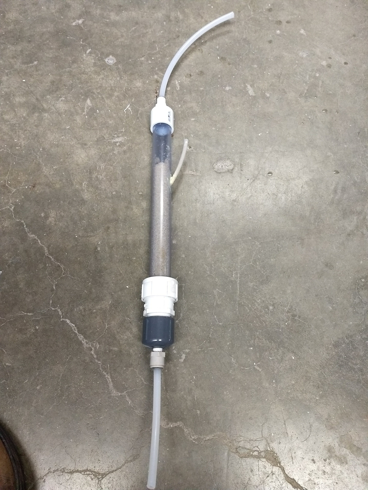
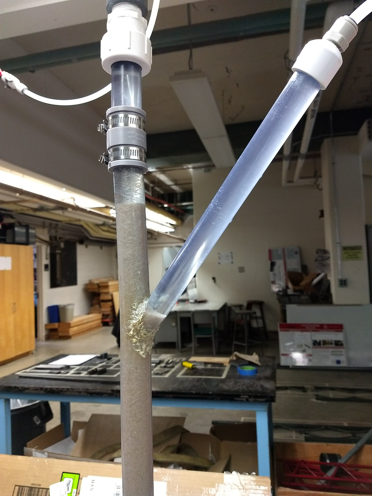

# Horizontal Filtration, Spring 2018
#### Clare O'Connor, Corson Chao, and Christopher Galantino
#### 3/1/2018

<div class="alert alert-block alert-danger">
Please do not delete my comments. On the next submission I will use them to see if the issues were addressed and then I will delete them. If you disagree with a comment, just add your own underneath it.
</div>

## Abstract
Horizontal filtration is a completely new innovation for the AguaClara team, arising from a desire to make the 1 L/s plants easier to make and ship by eliminating the Enclosed Stacked Rapid Sand Filter. To create a horizontal filter, aspects of the sedimentation tanks and current filter design will be used, such as the relationship between backwash and operational speed, as well as the design of the plate settlers. Initial experimentation with the settling of sand during upflow is promising for when construction of the filter prototype begins.

## Introduction

The plantita (1 L/s plant) is a difficult apparatus to construct and implement. Finding a way to make fabrication, assembly, and installation simpler, as well as downsize components, will greatly decrease the cost and make the technology more accessible for global communities.

The concept of an easy to implement, versatile water treatment plant correlates nicely with the [OrigamiWaterLab](https://github.com/OrigamiWaterLab) proposed by AguaClara engineer [Ethan Keller](https://github.com/ethan92429). Essentially, ingenious engineering is found in simplicity and resiliency. Fabricating a plant that transitions from flat into 3D is a innovative area of study that may become more possible with increased exploration.

<div class="alert alert-block alert-danger">
Explain what OrigamiWaterLab is.
</div>

With this idea in mind, one of the most difficult features to construct in an efficient, mass-producible way is the filter. Currently, the 1L/s plant’s filter is characterized by a vertical, enclosed stacked rapid sand filter (EStaRS) which is tall and cumbersome to ship in addition to having a complicated geometry of 4 inlet manifolds and 3 outlet manifolds.

<div class="alert alert-block alert-danger">
~Is plantita the technical term?(slang)

Consider different word choice than "mass-producible" and "unfriendly"
</div>

To combat these difficulties, we have proposed a horizontal filter design. This filter will not be stacked. Instead, it will use horizontal flow for filtration and vertical flow for backwash. We will design the ratio of the horizontal flow area to the vertical flow area so that the bed will fluidize during backwash. The inlet and outlets will be designed so that sand/water separation doesn’t require slots. Water will exit through a geometry that has a plate settler style design to ensure that sand settles out and isn’t carried into the effluent. The designing of the horizontal filter will utilize both current filtration techniques and technologies from the plate settle design in the sedimentation tanks. This developed technology might then also be adapted to replace the slotted pipes in the current Stacked Rapid Sand Filters in the full-sized plants.

<div class="alert alert-block alert-danger">
~Aim for active voice

Good explanation of context and important design considerations
</div>

The goal is that these design innovations will simplify the current design and facilitate scaleup and mass production of AguaClara technologies.

## Methods


As we are still waiting for materials as of the first report, much of our work has been making calculations, learning Fusion360, and performing minor experiments. These experiments were done to verify hypotheses when calculations didn't yield conclusive answers. The experiments focused on determining the length of the filter shelves (the adapted plate settles) which would allow sand to settle before climbing into the outlet and flowing out of the filter. To do this two tests were run.

<div class="alert alert-block alert-danger">
~Choose first or third person
~parallel sentence structure in listd
</div>

Two similar apparatuses were constructed to determine the length of the fitler shelves based on how sand settled in angled tubes of different diameters. The first setup included a 1" diameter pipe as the filter body and 1/8" tube as an angled outlet(Figure 1) Forty-five degrees was chosen as the angle to allow the most sand to fall while not changing the flow too much. Sand, then water were poured in to see if sand would travel into the outlet during startup conditions. It did. From there the pumps were turned on to mimic water flow during filtration and backwash. The speed in the filter body was set to be the speed required for backwash, 9mm/s, and the speed in the angled outlet was set to the speed during operation 1.8mm/s as that is the maximum water velocity that should be experienced within the filter shelves. Upon completion of this test, a new apparatus was constructed.

|  |
|:--:|
| *Figure 1. First experimental apparatus with 1" diameter filter and 1/8" outlet tube. Influent water comes in through the bottom and out through the angled outlet and the top.* |

The original idea for the new apparatus was to have a 1" angled tube stemming from the 1" filter. This proved nearly impossible to fabricate, so as in Figure 2, a 3/4" angled outlet pipe was used instead. In this test, the same steps were taken, dry sand was poured to determine how sand would travel. Then water was added, which caused sand to move several inches up into the outlet tube. However, the level of sand retreated once the pumps were turned on and operating at backwash and operational speeds.

|  |
|:--:|
| *Figure 2. Second experimental apparatus with 1" diameter filter and 3/4" outlet tube. Influent water comes in through the bottom and out through the angled outlet and the top.* |

### Experimental Apparatus

When the tank is constructed that will go here as it is our main apparatus!

Explain your apparatus setup using enough detail such that future teams can recreate your apparatus. Make sure to explain why you built it this way.
* Design (calculations, constraints)

  $\frac{-b\pm\sqrt{b^2-4ac}}{2a}$
* Schematic (label parts)

  

* Image (from lab; label parts)
* Materials (dimensions, materials)
* Complications in construction
* If already constructed: write a brief summary of important constraints, include any revisions to apparatus, also reference the prior report where construction is described

### Procedure

We don't have a real one yet!

Discuss your experimental procedure. How did you run your experiment? What were you testing? What were the values of relevant parameters?

## Results and Analysis

We don't have these yet!


Present an observation (results), then explain what happened (analysis).  Each paragraph should focus on one aspect of your results. In that same paragraph, you should interpret that result.
In other words, there should not be two distinct paragraphs, but instead one paragraph containing one result and the interpretation and analysis of this result. Here are some guiding questions for results and analysis:

When describing your results, present your data, using the guidelines below:
* What happened? What did you find?
* Show your experimental data in a professional way.
*
```python
from aide_design.play import*
x = np.array([1,2,3,4,5])
y = np.array([1,2,3,4,5])
plt.figure('ax',(10,8))
plt.plot(x,y,'*')
plt.savefig('/Users/jillianwhiting/github/Jillian-Whiting/Images/linear')
plt.show()
```

Figure 1: Captions are very important for figures. Captions go below figures.

After describing a particular result, within a paragraph, go on to connect your work to fundamental physics/chemistry/statics/fluid mechanics, or whatever field is appropriate. Analyze your results and compare with theoretical expectations; or, if you have not yet done the experiments, describe your expectations based on established knowledge. Include implications of your results. How will your results influence the design of AguaClara plants? If possible provide clear recommendations for design changes that should be adopted. Show your experimental data in a professional way using the following guidelines:
* Why did you get those results/data?
* Did these results line up with expectations?
* What went wrong?
* If the data do not support your hypothesis, is there another hypothesis that describes your new data?

## Conclusions
Explain what you have learned and how that influences your next steps. Why does what you discovered matter to AguaClara?

Make sure that you defend your conclusions with facts and results.

## Future Work
Describe your plan of action for the next several weeks of research. Detail the next steps for this team. How can AguaClara use what you discovered for future projects? Your suggestions for challenges for future teams are most welcome. Should research in this area continue?

Once the acrylic box for the team comes in, construction of the full filter will begin. This will include construction the filter shelves, sloped bottom, EPDM sealed doors, and the siphon to start backwash.

# Manual
The goal of this section is to provide all of the guidance that would be necessary for a future team to pick up your work where you left off. Please try to be thorough and put yourselves in the shoes of a newcomer to the project. Below are some recommended sections, but the manual will likely take a slightly different form for each team.

## Fabrication Details
Include any information related to the fabrication of equipment, experimental apparatuses, or technologies. Include the purpose of each step and the fabrication methods used. Reference appropriate safety precautions.

For our experiment testing sand settling at various flow rates, both the main tube and the extension 3/4" tube needed to be cut with angled holes using the drill press in order to weld together properly. The welding needed to be performed multiple times to assure that the apparatus was watertight.

<div class="alert alert-block alert-danger">
~Please write this up nicely, but as it is not the major focus, keep it brief.
</div>

## Special Components

Acrylic Box: An acrylic container of specifications 18x18x24" bought from [Shop Pop Displays](http://www.shoppopdisplays.com/P_PED-ACRYLIC-CLEAR-FLAT/clear-acrylic-pedestal.html) in order to act as an observable smaller model of the designed horizontal filter.

<div class="alert alert-block alert-danger">
~Formatting?
</div>

## Experimental Methods

### Filter Shelf Length Tests

#### Experiment: 1" and 1/8"
1. First a mock filter was constructed using a 1" clear PVC pipe; in this pipe an angle hole was drilled at 45 degrees from the vertical around 5 inches from the top of the pipe. Into this hole, a small length of 1/8" tubing cut on one end to an angle of 45 degrees was inserted and glued. See Figure 1 above for an image of the apparatus.
2. Dry sand was poured from the top into the apparatus to see if dry sand would move up the outlet tube when the sand level was two inches above the angled outlet. It did not.
3. An additional 500g of sand were poured in increments of 100g, this corresponded with an additional height of about 1.5ft in the 1" pipe. At no point did dry sand enter into the outlet tube.
4. Water was then slowly added into original amount of sand, during this process water carried sand into the first inch of the outlet tube.
5. Pumps were checked for proper flow rate to get proper water velocity in the outlet tube as corresponding to the outlet diameter and speed required for backwash and operation speed. The water within the body of the filter was moving at a speed required for backwash and the outlet pull was at the speed required during operation as that should be the maximum velocity experienced in the filter shelves.
6.Water was then pumped through the very wet sand. Sand moved around 3 inches up the length of the outlet tube. Preferential flow paths were observed as the apparatus was tilted.

<div class="alert alert-block alert-danger">
Check formatting

~In Step 5 it says that the body of the filter was moving, which is probably not what you mean to say.
</div>

#### Experiment: 1" and 3/4"

1. Originally, the plan had been to use 1" and 1" but fabrication of the experimental apparatus was extraordinarily challenging, so the outlet tube dimension was changed to reflect what was possible to construct. Because of this a 3/4" inch pipe was used instead. Using a hole saw an angled hole was drilled in to the main 1" tube. The 3/4" pipe was then also cut on one end with the same size hole saw bit. This meant that the curvature of each piece fit together more snugly than had the 3/4" pipe been sliced flat. Then the two pieces were welded together.
2. Sand was poured into the container to a level of around 4 inches above the opening of the angled outlet. Sand settled slightly into the angled tube.
3. The apparatus was filled with water, and the inlets and outlets were hooked up to their respective pumps and waste lines. At this point the sand rose in the outlet column to a length of around 3 inches.
4. The pumps were reset to work at the new speeds needed to pull water through the outlet at 1.8mm/s and through the main filter at 9mm/s. As the sand in the main column fluidized the sand dropped in the outlet column down to a length of 1.1" which remained constant over the several minutes the pumps were on.
5. The pumps speeds were altered away from what would be useful during operation to develop a sense for what effect that could have on the effectiveness of the filter shelves. Below is a table of the values obtained.

<div class="alert alert-block alert-danger">
Unclear what the purpose of a bigger angled part is? What is the modeling - this should probably be put higher or maybe a new section of design considerations should be written
</div>

#### **Table of  pump speed and sand length in outlet tube**
|filter speed (rpm)|outlet speed (rpm)|sand length in tube(in)|
|:---:|:----:|:----:|
|73|11.4|1.1|
|80|11.4|1.1|
|50|11.4|1.1|
|87|11.4|1.05|
|73|15|1.5|
|73|19|1.95|
|73|23|4|
|73|11.4|1.1|

From this data it is apparent that changing the speed that the water is being pulled out affects the height of sand in the filter shelf, but changing the overall flow does not, which makes sense as any water not pulled from the outlet just increases the flow through the unregulated outlet. With the proper pump speeds of 73 RPM influent, and 11.4 RPM pulled out the angled outlet, the length the sand travels into the outlet, 1.1", is a small enough distance to make the actual construction feasible. The influent and effluent speeds differ due to the actual model having mutiple holes to create outflow but in this one hole model, the amount that would be measured going into the other holes was just left as waste outflow rather than along with the effluent. The python code below explains the significance of these values and how they were determined.

<div class="alert alert-block alert-danger">
~First sentence/most of the paragraph is not understandable at this time.

Where are your units? Why are the influent and effluent speeds different (is the flow maintained)? Show that equation
</div>

### Sand Movement in Flat Filter shelves

This is an upcoming event, which has been included to assist in developing the organization structure of this section.
#### Set-up
#### Experiment

## Experimental Checklist
Another potential section could include a list of things that you need to check before running an experiment.


### Variables

#####Calculation of Backwash and Flow Area
- $V_{filter}$=***V_filter***=Velocity of filtration
- $V_{backwash}$=***V_backwash***=Velocity of water during backwash
- $Q_{plant}$=***Q_plant***=Water flow through plant
- $A_{backwash}$=***A_backwash***=Area of backwash
- $A_{flow}$=***A_flow***=Cross sectional area of sand/area of flow

#####Calculation of Filter Box Dimensions
- $\pi_{FiBw}$=***PiFiBw***=Volume increase ratio due to sand bed fluidization
- $l_{filter}$=***filter_length***=Length of filter
- $w_{filter}$=***filter_width***=Width of filter
- $h_{filter}$=***filter_height***=Height of entire filter
- $h_{box}$=***box_height***=Height of utilized box model

#####Filter Shelf Optimization
- $\nu$=Kinematic viscosity
- $\rho_{sand}$=***rho_sand***=Density of particle
- $\rho_{water}$=***rho_water***=Density of water
- $\nu_{water}$=***nu_water***=kinematic viscosity of Water
- $d_{sand}$=***d_sand***=Diameter of sand particles
- $SF$=***SF***=Safety factor
- $\theta_{settling}$=***angle_settling***= Angle of filter shelves
- $V_{setting}$=***V_settling***=Velocity until the sand settles
- $V_{capture}$=***V_capture***=Safe estimate of velocity needed to capture the sand
- $V_{\alpha}$=***V_alpha***=Filter speed
- $V_{actual}$=***V_actual***=Filter speed after filter shelf
- $S_{shelf}$=***S***=Distance between filter shelves
- $\alpha$=***alpha***=angle of shelves
- $l_{shelf}$=***L***=Length of filter shelf

## Python Code, Fusion, and Calculations

The purpose of this filter assembly is for simplicity and easy fabrication. The filter exists within an acrylic box with an inflow and an outflow as the empty cavities that don't contain the sand filtering section. The sand column section itself exists in the middle of the filter box with a filter shelf insert that can be added or removed.

<div class="alert alert-block alert-danger">
Reference drawing because the description is confusing and hard to imagine
</div>

The team must first calculate the dimensions of the sand filter space which will make up a section of the overall apparatus. To do this, HorFi (Horizontal Filtration Team) takes into account the velocity at which water moves through a sand filter and the desired flow rate of the system. Since creating a 1 L/s apparatus would take all semester, the team begins with a scale model at 0.1 L/s.

<div class="alert alert-block alert-danger">
~Define HorFi
</div>

Since the backwash velocity (V_backwash) is greater than the filter velocity (V_filter), it is the design constraint. With some math, the area of backwash (A_backwash) and area of flow (A_flow) may be calculated.

```python
from aide_design.play import*
V_filter = 1.8*(u.mm/u.s)
V_backwash = 9*(u.mm/u.s)  #the constraining velocity
Q_plant = .37*(u.L/u.s)  #the scale we are working with for our first iteration of the filter, manipulated to achieve desired width
A_backwash = Q_plant/V_backwash #plan view area of sand (x,y axis)
A_flow = Q_plant/V_filter  #cross sectional area of sand (x,z axis)

```
From here, the team must incorporate some knowledge on the depth in which water travels through a traditional AguaClara OStaRS filter. The filter backwash ratio is the ratio between settled sand height during filtration and expanded sand height during backwash. Because the filter backwash ratio is 1.3 (PiFiBw), which has been empirically determined, the team must determine a settled sand height first.

The team decides that with the scale model in mind, 3.65 inches of sand in the flow direction (filter_length) is a fair parameter to start with. With this one measurement, and the ratio between filter velocity and backwash velocity, all other parameters fall into place.

```python
PiFiBw = 1.3
filter_length = 3.65*u.inch  #manipulated to achieve desired height
filter_width = A_backwash/filter_length #the filter width is the width for BOTH areas
filter_height = A_flow/filter_width
filter_height #height of sand
box_height = filter_height*PiFiBw #the height the expanded sand bed
box_height
#the box we ordered is 18 inch by 18 inch by 24 inch with wall thickness of 0.25 inches
print(box_height.to(u.inch)) #must be 0.25 less than actual because of thickness of the box floor ordered
print(filter_width.to(u.inch)) #must be 0.25*2 less than actual because of thickness of walls on either side
print('The height of the tank should be at least',box_height.to(u.inch),'with a cross-sectional width of',filter_width.to(u.inch),'(thicknesses omitted).')
>>> height is 23.72 inches, cross sectional width of 17.46 inches
```

With these dimensions calculated, the filter box can then be rendered as seen below in Figure X. (don't have figure numbers figured out yet)


Notice the blue line on the filter box floor. Depending on the sand filter length determined and length needed between filter shelves, this will be the location for the entrance and exit plates with the filter shelf insert the appropriate width to ensure a snug fit.

<div class="alert alert-block alert-danger">
Unclear what the entrance and exit plates are and how they will insert. It is all the way around like stacked dolls?
</div>


**Note:** We still need to determine the hole diameter for the entrance and exit plates so for now the Fusion rendition has a solid plate.

Between these plates will be the filter shelf insert, a series of suspended, angled shelves that serve to both shelter the holes during routine filtration and also return sand during backwash. Below is the center plate, a component of the filter shelf insert.


<div class="alert alert-block alert-danger">
Add link to the actual fusion drawing so I can check scale in the future.
</div>

The current plan is to have 3 of the plates perpendicularly oriented with respect to the entrance and exit plates to provide support for the long filter shelf pieces. The number of filter shelves to add will be determined by the distance between respective shelves. This will be optimized by investigating how far sand will travel before settling on the plates due to the velocities of this system.

Below is the equation for terminal settling velocity where d is diameter, $\nu$ is kinematic viscosity

$$ Vt = \frac{d^2g}{18\nu}(\frac{\rho_{particle}-\rho_{H2O}}{\rho_{H2O}}) $$

**Note:** we need to change this formula to the appropriate one that incorporates drag

```python
SF =2 #safety factor

rho_sand = 1602*u.kg/u.m**3 #density of sand
rho_water = 1000*u.kg/u.m**3 #density of water at 20 C
nu_water = (pc.viscosity_kinematic(293*u.K)) #kinematic viscosity of water at 20 C
d_sand = 0.5*u.mm #diameter of sand particle
alpha = 55*u.degrees #angle of filter shelves
V_alpha=1.8*u.mm/u.second
 #filter speed!

V_actual = V_alpha/np.cos(alpha) #speed within the angled shelf
S=(1*u.inch).to(u.mm) #distance between shelves (above or below)

V_settling1=((d_sand**2)*pc.gravity/(18*nu_water))*((rho_sand-rho_water)/rho_water)
V_settling1.to(u.mm/u.s)  #settling velocity without drag and turbulence
>>>82 mm/s
V_capture1 = V_settling1/SF #Capture velocity with safety factor incorporated
V_capture1.to(u.mm/u.s) #initial capture velocity
>>>41 mm/s

Re = (V_backwash)*(1*u.inch)/(nu_water)
Re.magnitude #Reynold's number for drag coefficient calc
Cd = 0.2 #drag coefficient corresponding with ~10^7
V_settling2 = np.sqrt(((4*pc.gravity*d_sand)/(3*Cd))*((rho_sand-rho_water)/rho_water))
V_settling2.to(u.mm/u.s)
>>> 140 mm/s #this velocity uses the drag coefficient based of the Reynolds number
V_capture2 = V_settling2/2
>>> 70 mm/s #alternative capture velocity

L1=((V_actual*S/V_capture1-S)/(np.cos(alpha)*np.sin(alpha)))
L2 = (S/np.cos(alpha))*((V_actual/V_capture2)-(1/np.sin(alpha)))
L1.to(u.inch)
L2.to(u.inch)
```
These lengths make the team believe that the length of the filter shelf is arbitrary. This seemed to correlate with the experiments as well.

```python
#we decided that the diameter of a hole should be 0.25 inches and we worked from there. space_sandlift was a guessed value of a safety for how high the sand would climb in between adjacent plate shelves
space_shelf = 0.25*filter_length
diam_holes = 0.25*u.inch

#how many holes will we need?
num_holes = filter_height.to(u.cm)/space_shelf.to(u.cm)
>>> num_holes = 20

#what is the headloss? (due to wall in middle of insert, there will be twice as many holes)
pi_orifice = 0.62
headloss_hole= pc.head_orifice(diam_holes,pi_orifice,Q_plant/(2*num_holes))
>>>headloss_hole = 1.13 cm

#length of plate and therefore length of insert?
thickness_shelf = 0.125*u.inch
space_sandlift = 1*u.cm
space_above_hole = space_shelf-diam_holes-thickness_shelf-space_sandlift
>>> space_above_hole = .36525 cm #space above hole
L_vert = (diam_holes+thickness_shelf+space_sandlift+space_above_hole)
L_vert.to(u.cm)
>>>L_vert = 2.3177 cm
L = L_vert/(np.sin(alpha))
L.to(u.cm)
>>> L = 2.82945 cm #length of filter shelf
L_notch = L/4
L_notch.to(u.cm)
>>> L_notch = .70736 cm
L_horizontal = L*np.cos(alpha)
L_horizontal.to(u.cm)
>>> L_horizontal = 1.62291 cm
insert_length = 2*L_horizontal+filter_length
insert_length.to(u.cm)
>>> length_insert = 12.517 cm
#cut the insert width as accurately as possible. Within 0.5% error so we should be good
>>> Actual length_insert =
```
With this length calculated and confirmed through experimental procedure, the overall insert may be produced.

<div class="alert alert-block alert-danger">
What is this length?
</div>

```python
exp_length = 1.1*u.inch
height_opening = np.sin(alpha)/.75

```


# To convert the document from markdown to pdf
pandoc Name_of_this_file.md -o TeamName_Research_Report.pdf
```
